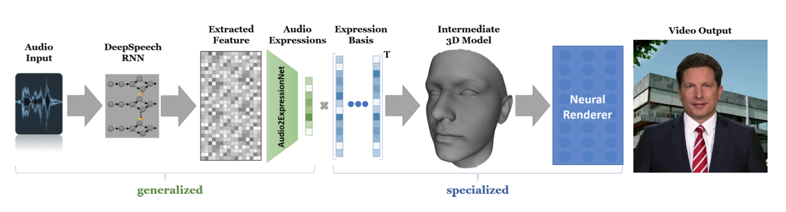

<div align="center">
  
</div>

# <div align="center"> AvatarForge </div>
<div align="center">Make your own digital avatars.</div>

<br/><br/>


## Project Details
This repo contains the code of the project: Audio Driven Video Synthesis Of Personalized Moderations. 

Check out the project's scope and details on our [website](https://mtc.ethz.ch/research/image-video-processing/video-synthesis.html).

#
## Table of Contents
1. [Demo Description](#demo-description)
2. [Available Models](#available-models)
    1. [Neural Voice Puppetry](#neural-voice-puppetry)
    2. [Motion GAN](#motion-gan)
3. [Data](#data)
4. [Usage](#usage)
    1. [Train New Avatars](#train-new-avatars)
    2. [Inference for NeuralVoicePuppertry Model](#inference-for-neuralvoicepuppertry-model)
    3. [Inference for MotionGan Model](#inference-for-motiongan-model)
    4. [Build and Run Docker Containers](#build-and-run-docker-containers)
    5. [API Usage](#api-usage)

#
## Demo Description
This tool allows you to generate your own deepfake avatar video. 

- Provide a short video and train your own avatars.

- Pick an avatar from our available collection, record your own audio snippet and wait for the automated process to complete. After a few minutes, your deepfake avatar video can be found in the gallery.

#
## Available Models
You can find here the code for the two pipelines implemented during this project:
- Neural Voice Puppetry
- Motion GAN

*More details for each pipeline can be found in the respective READMEs.*


### Neural Voice Puppetry



### Motion GAN 


#
## Data
If you plan on using this code with the already available and pre-trained moderators, you will only have to provide the audio data. Otherwise provide both audio and video.

Please follow these instructions on data quality: 
- Audio 
    - Provide a recording of a person speaking (audio of any duration is accepted).
    - The cleaner the audio signal the better: audio with background noise will result in unmatching lip-sync.
    - Avoid recording multiple people talking: the model is unable to distinguish between multiple voice signals.
- Video
    - Provide a video of your desired avatar character talking.
    - Minimum video duration: 3 minutes.
    - Longer videos will results in longer training time.
    - The background is irrelevant, it will be removed during preprocessing.
    - Avoid hand or arms movements. Having such movements (that might cause occlusion) will interfere with the quality of the generated frames during training.

#
## Usage
You can follow the instructions in each README to clone the respective repositories and run the python code independently.

Following are some instructions to build both models using **Docker**.
### Train New Avatars
* Place the new video in `/data/{model-name}/input_data/video`. Where `model-name` is either `motionGan` or `neuralVoice`.
  Be aware that the name of the folder determines the avatar name.
    ```bash 
    input_data
        └── video # Folder containing m video files
            ├── avatar_1
            │       └── avatar_1.mp4
            ...
            └── avatar_m
            │       └── avatar_m.mp4
            │
            └── my_new_avatar
                    └── my_new_avatar.mp4

    ```

* Set the `AVAILABLE_AVATARS` variable in `.env`/`debug.env` to the name of your new avatar(s) using a comma separated list
* Build and run the docker containers using instructions [here](#build-and-run-docker-containers). 
* Use the API as described [here](#api-usage).

#
### Inference for NeuralVoicePuppertry Model
* Place the checkpoints directory in `/data/neuralVoice/checkpoints`. Be aware that the name of the folder determines the avatar name. This directory must contain the following elements:
    ```bash 
        checkpoints
           └── my_avatar
               ├── latest_inpainter.pth # Weights for the inpainter network
               ├── latest_netD.pth # Weights for the discriminator network
               ├── latest_texture_decoder.pth # Weights for the neural renderer network
               └── latest_texture.pth # Learned neural texture
    ```
    *Note: all these files will be generated automatically when training an avatar on a new video.*

* Place the checkpoints directory in `/data/neuralVoice/features`. Be aware that the name of the folder determines the avatar name. This directory must contain the following elements:
    ```bash
        features
           └── my_avatar
               ├── DECA_codedicts # folder containing all DECA morphable model information per frame
               ├── og_frames # folder containing all extracted video frames
               ├── my_avatar.h5 # H5 file containing all tracking information for each frame
               └── tform.npy # numpy file containing all transformation required to crop each frame 
    ```
    *Note: all these files will be generated automatically when training an avatar on a new video.* 

* Place the checkpoints directory in `/data/neuralVoice/mappings`. Be aware that the name of the folder determines the avatar name. This directory must contain the following elements:
    ```bash
        mappings
            └── audio2ExpressionsAttentionTMP4-estimatorAttention-SL8-BS16-ARD_ZDF-multi_face_audio_eq_tmp_cached-RMS-20191105-115332-look_ahead
                       └── mapping_my_avatar.npy # file containing mapping between audio expressions and person specific expressions      
    ```
    *Note: all these files will be generated automatically when training an avatar on a new video.*

* Place the input video directory in `/data/neuralVoice/input_data/video`. Be aware that the name of the folder determines the avatar name. This directory must contain the following files:
    ```bash 
    input_data # Folder containing all input data
        └── video # Folder containing video files
            └── my_avatar # Folder generated by running the pipeline: contains "my_new_avatar" video processed information
                    ├── my_avatar.mp4 # original video of the avatar
                    └── my_avatar.wav # extracted audio from the original video
    ``` 
    *Note: all these files will be generated automatically when training an avatar on a new video.*

* Set the `AVAILABLE_AVATARS` variable in `.env`/`debug.env` to the name of your avatar(s) using a comma separated list
* Build and run the docker containers using instructions [here](#build-and-run-docker-containers).
* Use the API as described [here](#api-usage).

#
### Inference for MotionGan Model
* Place the checkpoints directory in `/data/motionGan/checkpoints`. Be aware that the name of the folder determines the avatar name. This directory must contain the following elements:
    ```bash 
    checkpoints # Folder containing all checkpoints of trained avatars 
        └── my_avatar # Folder containing checkpoints of the "my_new_avatar" Avatar
            ├── GAN_config.txt # GAN configuration parameters during training
            ├── head2body.pkl # checkpoint for head position to body position regression
            ├── head2body_test.png # result of the regression
            ├── latest_Audio2Headpose.pkl # checkpoint for audio to head-motion finetuned network
            ├── latest_GAN_model.pt # checkpoint for the GAN network
            ├── logs # folder containing all training logs during GAN training
            └── train_opt.txt # audio to head-motion configuration parameters during finetuning
    ``` 
    *Note: all these files will be generated automatically when training an avatar on a new video.*


* Place the input video directory in `/data/motionGan/input_data/video`. Be aware that the name of the folder determines the avatar name. This directory must contain the following files:
    ```bash 
    input_data # Folder containing all input data
        └── video # Folder containing video files
            └── my_avatar # Folder generated by running the pipeline: contains "my_new_avatar" video processed information
                    ├── img_size.npy # file containing information about the frame size
                    ├── mapping.npy # file containing mapping between audio expressions and person specific expressions
                    └── track_params.pt # file containing all head poses and tracked information of the original video 
    ``` 
    *Note: all these files will be generated automatically when training an avatar on a new video.*


* Set the `AVAILABLE_AVATARS` variable in `.env`/`debug.env` to the name of your avatar(s) using a comma separated list
* Build and run the docker containers using instructions [here](#build-and-run-docker-containers).
* Use the API as described [here](#api-usage).

#
### Build and Run Docker Containers
* Run the application using one of the following commands:
    * In order to run a regular, full run including both models, run the following:
        ```bash
        docker compose up --build     
        ```
        This configuration makes use of the settings specified in the `docker-compose.yml` and the `.env` files
    * In order to run a reduced debug setup, run the following:
        ```bash
        docker compose -f docker-compose.yml -f docker-compose-debug-yml up --build backend {model-name}
        ```
        Where `{model-name}` is either `nerual-voice-model` or `motion-gan-model`.
        
        This configuration overrides the settings specified in the `docker-compose.yml` and the `.env` files with those in the `docker-compose-debug.yml` and `debug.env` files respectively.

#
### API Usage
In order to interact with the running api server, access `http://localhost:5000/api/docs`, then navigate to the following routes:
* `POST /api/inference`: Run inference on a new input audio. If the selected avatar has not yet been trained, this will perform the training.
Inference should take roughly a minute for most short audio clips, training will take roughly 8 to 24 hours
* `GET /api/videos`: Returns the metadata for all generated videos, including ones currently being processed. Note the `inferenceCompleted` flag, indicating whether inference for this particular video has been completed.
* `GET /api/video`: Returns the video in a common web streaming format that can be displayed by most modern video players & browsers but does not work properly with the docs page.
Alternatively you can retrieve your finished videos from the folder structure the same way you added the input videos under `data/{model-name}/output_data/video`.
* `DELETE /api/video`: Deletes all data about a generated video from the database as well as the file system.

#
### LICENSE

This implementation AvatarForge is free and open source! All code in this repository is licensed under:

* [MIT](LICENSE) License.

Both pipeline rely and are inspired by the other works works. You can find further information in each the READMEs of both offered pipeline.

#
### Contact information

Alberto Pennino: [alberto.pennino@inf.ethz.ch](alberto.pennino@inf.ethz.ch)