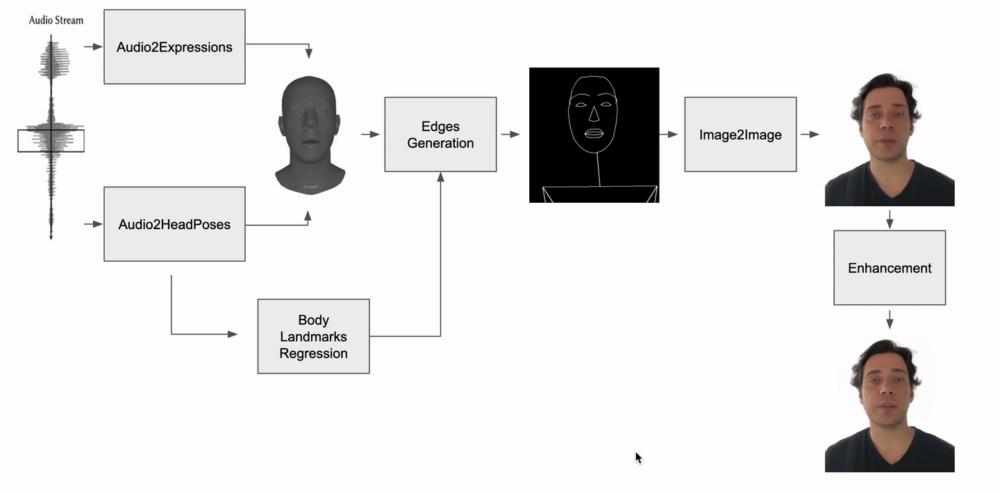
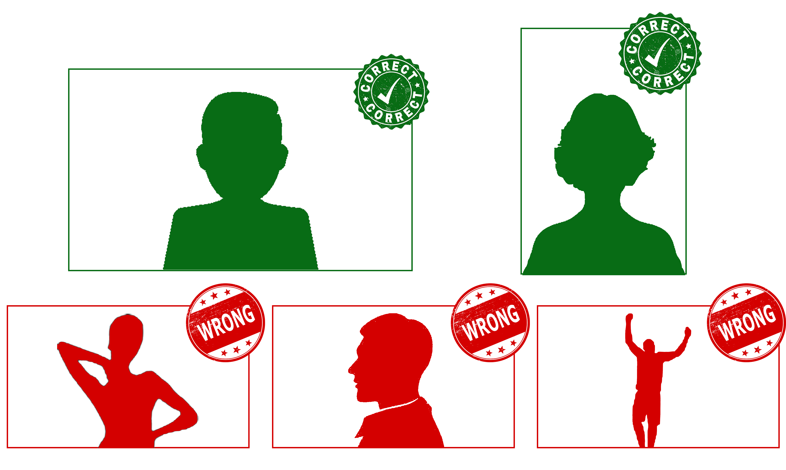

# Audio-Driven Video Synthesis

This repository contains the new end-to-end "Audio Motion GAN pipeline" for the Audio-driven Video Synthesis project.

## Requirements

<!-- Please clone this repository with the following commands in order to download all the related submodules:
```bash
git clone https://gitlab.ethz.ch/mtc/video-synthesis/motion-gan-pipeline
cd motion-gan-pipeline
git submodule init
git submodule update
```

Create a [conda](https://www.anaconda.com) environment:
```bash
conda create -n pyenv python=3.7
```
 
To install the requirements please use the package manager [pip](https://pip.pypa.io/en/stable/):
```bash
conda activate pyenv

# Install Pytorch and cudatoolkit, we tested with version 11.1
conda install pytorch torchvision torchaudio cudatoolkit=11.1 -c pytorch -c conda-forge
# With Nvidia 3090 do this instead:
pip install torch==1.9.1+cu111 torchvision==0.10.1+cu111 torchaudio==0.9.1 -f https://download.pytorch.org/whl/torch_stable.html

# Install ffmpeg for video editing
conda install x264=='1!152.20180717' ffmpeg=4.0.2 -c conda-forge

# Install pip dependencies
pip install "git+https://github.com/facebookresearch/pytorch3d.git@stable"
pip install -r requirements.txt

# Set up enhancements tool
cd GFPGAN 
python setup.py develop
cd ..
```

Alternatively run the following:
```bash
conda env create -f environment.yml python=3.7
conda activate pyenv
pip install torch==1.9.1+cu111 torchvision==0.10.1+cu111 torchaudio==0.9.1 -f https://download.pytorch.org/whl/torch_stable.html
pip install -r requirements_pip.txt

cd GFPGAN 
python setup.py develop
cd ..
``` -->

Please clone this repository with the following commands in order to download all the related submodules:
```bash
git clone https://gitlab.ethz.ch/mtc/video-synthesis/motion-gan-pipeline
cd motion-gan-pipeline
git submodule init
git submodule update
export PROTOCOL_BUFFERS_PYTHON_IMPLEMENTATION=python
```

Create a [conda](https://www.anaconda.com) environment:
```bash
conda create -n deepspeech python=3.7
```

To install the requirements follow these instructions:
```bash
conda activate deepspeech

conda install pysoundfile -c conda-forge
# Install Pytorch and cudatoolkit
pip install torch==1.9.1+cu111 torchvision==0.10.1+cu111 torchaudio==0.9.1 -f https://download.pytorch.org/whl/torch_stable.html
# Install the rest of the pip requirements
pip install -r requirements_deepspeech.txt

conda deactivate
```

Create a [conda](https://www.anaconda.com) environment:
```bash
conda create -n pyenv python=3.9
```

To install the requirements follow these instructions:
```bash
conda activate pyenv

conda install pysoundfile -c conda-forge
# Install Pytorch and cudatoolkit
conda install pytorch=1.13.0 torchvision pytorch-cuda=11.6 -c pytorch -c nvidia
# Install ffmpeg for video editing
conda install x264=='1!152.20180717' ffmpeg=4.0.2 -c conda-forge
conda install -c fvcore -c iopath -c conda-forge fvcore iopath
# Install pytorch3d
conda install pytorch3d -c pytorch3d
# Install the rest of the pip requirements
pip install -r requirements.txt

# Set up enhancements tool
cd GFPGAN 
python setup.py develop
cd ..

conda deactivate
```

## Goal 

This project is designed to generate realistic videos of human avatars. Given an audio recording and a choosen video of a target person, the code will produce a new video of that person pronouncing the given audio. 

The produced video is fully artificial: everything from the lip movement, to the head movement, to the singluar frames of the video is completely generated. \
When an avatar is trained once, it can be used multiple times with any given audio source.

<!-- <video src="https://youtu.be/7zK_Wmpxrd0" controls="controls" style="max-width: 720px;">
</video> -->

[](https://youtu.be/7zK_Wmpxrd0)

## Model Structure

You can observe the pipeline structure in the following image.



<b/>  </b> \
<b/>  </b> 

- <b/> Audio2Expressions </b> \
    The Audio2Expressions model is a network trained to generate FLAME facial expressions from the extracted audio DeepSpeech features. The Audio2Expressions model is inspired by [Neural Voice Puppetry](https://github.com/miu200521358/NeuralVoicePuppetryMMD). This network produces the corresponding mouth movements from the audio signal and is resposible for lip-sync.

- <b/> Motion Generation </b> \
    The Motion Generation model is a network trained to generate rotation and translation matrices from the extracted audio DeepSpeech features. This model predicts the corresponding head motion to certain audio inputs. The Motion Generation model is inspired by [Live-Speech Portraits](https://github.com/YuanxunLu/LiveSpeechPortraits). This network produces the head movements from the audio signal and is resposible for the overall head motion during the video.

- <b/> Edges Generation </b> \
    The Edge Generation model combines the information generated by the Audio2Expressions and the Motion Generation to render a FLAME facial mesh. Key landmarks are projected and rendered. Body landmarks (shoulders and hips) are extracted using [Mediapipe](https://github.com/google/mediapipe) during training, and predicted by a network during inference. This module prepares the input data for the Image2Image network.

- <b/> Image2Image </b> \
    The Image2Image model is a network trained to generate realistic images from edges information coming as input. \
    The Image2Image network transforms the images generated in the Edge Generation step to the final video frames. The image generation network is trained for both image fidelity (L1 loss, VGG loss) and temporal consistency (3D video discriminator).

- <b/> Image Enhancement </b> \
    Optionally the final output of the pipeline can be enhanced by using [GFPGAN](https://github.com/TencentARC/GFPGAN) and image restoration network. The enhancement only works on the facial area and produces more realistic results.


## Data
If you plan on using this code with the already available and pre-trained moderators, you will only have to provide the audio data. 

Please follow these instructions on data quality: 
- Audio 
    - Provide a recording of a person speaking (audio of any duration is accepted).
    - The cleaner the audio signal the better: audio with background noise will result in unmatching lip-sync.
    - Avoid recording multiple people talking: the model is unable to distinguish between multiple voice signals.
- Video
    - Provide a video of your desired avatar character talking.
    - Minimum video duration: 3 minutes.
    - Longer videos will results in longer training time.
    - The background is irrelevant, it will be removed during preprocessing.
    - Avoid any hand or arms movements. Having such movements will interfere with the quality of the generated frames during training.
    - Provide a half-body shot recording, possibly frontal.


Refer to the following image for shot instructions.




## Data structure

Your data should be organised in the following structure:

```bash 
$DATAROOT/input_data
├── audio # Folder containing n audio files
│   ├── audio_1
│   │   └──audio_1.wav
│   ...
│   └── audio_n
│       └──audio_n.wav
└── video # Folder containing m video files
    ├── video_1
    │   └──video_1.mp4
    ...
    └── video_m
        └──video_m.mp4

```

## Usage
The same command can be used for both training and inference. If the trained checkpoints for the requested avatar are not found, the code will launch the training procedure.

Use the following call to launch the code:
```bash
bash full_pipeline.sh $DATAROOT $AUDIO_NAME $VIDEO_NAME
```
Where:
- $DATAROOT: path to the data folder.
- $AUDIO_NAME: name of the audio file (without extension).
- $VIDEO_NAME: name of the video file (without extension). This will also be the name of the Avatar. 


If you want to launch the enhancement version please use this call instead:
```bash
bash full_pipeline_enhancement.sh $DATAROOT $AUDIO_NAME $VIDEO_NAME
```

## Train new Avatars
In order to train a new avatar follow this easy steps:

1. Record a new video following the instructions above. \
    Eg: VIDEONAME = my_new_avatar
2. Move your file to your data folder inside the video subfolder. 
    ```bash
    mv my_new_avatar.mp4 $DATAROOT/video/my_new_avatar.mp4 
    ```
3. Choose any audio file. \
    Eg: AUDIONAME = my_audio_sample

4. Start training (and inference) with the following command:
    ```bash
    bash full_pipeline.sh $DATAROOT my_audio_sample my_new_avatar
    ```
5. Wait until it's finished.
6. Enjoy your new Avatar! \
    You can now use the same avatar with any other audio file.

## Output Data
Ruinning this pipeline will generate the following data:

```bash 
$DATAROOT
├── input_data # Folder containing all input data
│   ├── audio # Folder containing audio files
│   │   └── my_audio_sample # Folder generated by running the pipeline: contains "my_audio_sample" audio processed information
│   └── video # Folder containing video files
│       └── my_new_avatar # Folder generated by running the pipeline: contains "my_new_avatar" video processed information
│
├── checkpoints # Folder containing all checkpoints of trained avatars 
│   └── my_new_avatar # Folder containing checkpoints of the "my_new_avatar" Avatar
│       ├── GAN_config.txt # GAN configuration parameters during training
│       ├── head2body.pkl # checkpoint for head position to body position regression
│       ├── head2body_test.png # result of the regression
│       ├── latest_Audio2Headpose.pkl # checkpoint for audio to head-motion finetuned network
│       ├── latest_GAN_model.pt # checkpoint for the GAN network
│       ├── logs # folder containing all training logs during GAN training
│       └── train_opt.txt # audio to head-motion configuration parameters during finetuning
│ 
└── output_data # Folder containing all output data
    └── my_audio_sample_to_my_new_avatar # Folder generated by running the pipeline command
        ├── generated_video.mp4 # Generated video
        └── generated_superes.mp4 # Generated enhanced video (only with the enhancement version)
```

## LICENSE

The AMG Pipeline is free and open source! All code in this repository is licensed under:

* [MIT](LICENSE) License.

This pipeline relies and is inspired by the following works, and therefore refers to their individual licenses:

- [GFPGAN](https://github.com/TencentARC/GFPGAN): [license](https://github.com/TencentARC/GFPGAN/blob/master/LICENSE), internal path `/GFPGAN`.
- [Live Speech Portraits](https://github.com/YuanxunLu/LiveSpeechPortraits): [license](https://github.com/YuanxunLu/LiveSpeechPortraits/blob/main/LICENSE), internal path `/motion-generation`.
- [Neural Voice Puppetry](https://web.archive.org/web/20201113014501/https://github.com/JustusThies/NeuralVoicePuppetry): [license](https://gitlab.ethz.ch/mtc/video-synthesis/.NeuralVoicePuppetry/-/blob/0fc75ba2edfdfd5655984f1515bfe06de880d91d/LICENSE), internal path `/preprocessing/third/Audio2ExpressionNet`.
- [DECA](https://github.com/YadiraF/DECA): [license](https://github.com/YadiraF/DECA/blob/master/LICENSE), internal path `/preprocessing/third/DECA`.
- [Robust Video Matting](https://github.com/PeterL1n/RobustVideoMatting): [license](https://github.com/PeterL1n/RobustVideoMatting/blob/master/LICENSE), internal path `/preprocessing/third/RobustVideoMatting`.
- [VOCA](https://github.com/TimoBolkart/voca): [license](https://voca.is.tue.mpg.de/license), used internally by DECA.
- [AD-NeRF](https://github.com/YudongGuo/AD-NeRF): [license](https://github.com/YudongGuo/AD-NeRF/blob/master/LICENSE), internal path `/preprocessing/face_parsing`, `/preprocessing/face_tracking`
- [DeepSpeech](https://github.com/mozilla/DeepSpeech): [license](https://github.com/mozilla/DeepSpeech/blob/master/LICENSE), used by VOCA.
- [CycleGAN and Pix2Pix](https://github.com/junyanz/pytorch-CycleGAN-and-pix2pix): [license](https://github.com/junyanz/pytorch-CycleGAN-and-pix2pix/blob/master/LICENSE), used as skeleton for GAN training.


## Contact information

Alberto Pennino: [alberto.pennino@inf.ethz.ch](alberto.pennino@inf.ethz.ch)