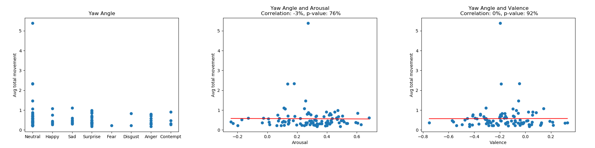

# Motion Generation

This is a re-adaptation of the [LiveSpeechPortraits](https://github.com/YuanxunLu/LiveSpeechPortraits) repository. \
The LSP pipeline generates realistic head motion from an input audio signal. \
We modified the original pipeline to generate head motion from extracted Deepspeech audio features.

## Requirements

```
conda create -n LSP python=3.6
conda activate LSP
```

- Clone the repository:

- FFmpeg is required to combine the audio and the silent generated videos. Please check [FFmpeg](http://ffmpeg.org/download.html) for installation. For Linux users,  you can also:

```
sudo apt-get install ffmpeg
```

- Install the dependences:

```
pip install -r requirements.txt
```

## Train on large dataset

We trained our model on a large video dataset [TED Dataset](https://snap-research.github.io/articulated-animation/) to learn generic human head motion.
You can download the dataset using the scripts in <i/>TED_dataset_utils</i>.

You can run the training script by using the following command:
```bash
python train.py --config config/Audio2Headpose_Ted_deepspeech.yml
```
You can crete your own config file using the <i/>make_config.py</i> script.

The following data structure is expected:
```bash
TED_dataset
├── Test
│   ├── VID_0
│   ...
│   └── VID_N
│
└── Train
    ├── VID_0
    ...
    └── VID_N
```

Where each video folder contains processed data that was generated using our [Preprocessing pipeline](https://gitlab.ethz.ch/mtc/video-synthesis/visionPreprocessing).

 
## Transfer & Finetuning
In the Audio-driven Video Synthesis project, we finetune over the checkpoint obtained by training on the TED dataset, using the input video data. We can therefore better fit the generated motion to the person specific motion presented in the video. 

The transfer is executed using: 
```bash
python transfer.py --dataroot $INPUTDATAPATH
                   --dataset_names $NAME_AUDIO 
                   --target_name $NAME_VIDEO 
                   --out_dir $OUTPUTFOLDER 
                   --checkpoint_dir $CHECKPOINTPATH
```
Where:
- ```$INPUTDATAPATH```: path to data folder.
- ```$NAME_AUDIO```: input audio name.
- ```$NAME_VIDEO```: target video name.
- ```$OUTPUTFOLDER```: path to the output folder.
- ```$CHECKPOINTPATH```: path to the checkpoints folder.

If no finetuned checkpoint for the requested video exists, the finetuning script is launched automatically.

Alternatively you can directly launch finetuning by running:
```bash
python finetune.py  --name $NAME_VIDEO
                    --dataset_mode $DATASETMODE
                    --dataroot $INPUTDATAPATH
                    --dataset_names $NAME_AUDIO
                    --fps $FPS
                    --target_checkpoints $OUTPUTCHECKPOINT
                    --checkpoint_path $TUNECHECKPOINT
```
Where:
- ```$NAME_VIDEO```: target video name.
- ```$DATASETMODE```: type of dataset, set to 'deepspeech'.
- ```$INPUTDATAPATH```: path to data folders.
- ```$NAME_AUDIO```: input audio name.
- ```$FPS```: target video's fps.
- ```$OUTPUTCHECKPOINT```: path to the output checkpoint directory.
- ```$TUNECHECKPOINT```: path to the checkpoints to finetune.

## Correlation Visuals
We also provide some scripts to visualise audio features, and compute audio features to head motion correlation.


- <b/>audio_visuals</b>: 
visualise multiple audio representations, original video, tracked FLAME head and Deepspeech features. 

    
<br/><br/>

- <b/>emotion_correlation_visuals</b>: 
plot and save correlation between EMOCA emotions and head motion.

    
<br/><br/>

- <b/>audio_correlation_visual</b>: 
plot and save correlation between audio features and head motion.

    


